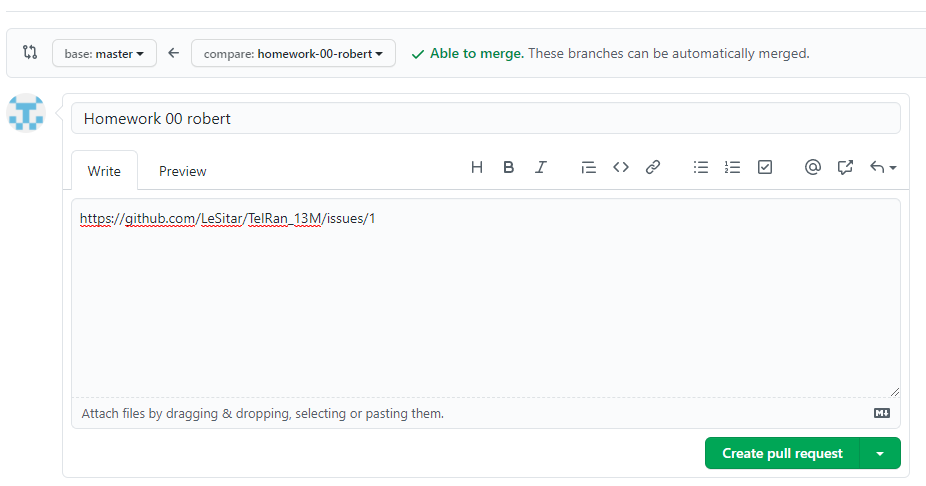

# 1. Создание репозитория на GitHub

Перейдите в свой GitHub аккаунт

Затем нажмите на кнопку «Repositories»

После на зелёную кнопку «New»

Вы должны увидеть вот такую страницу

В поле «Repository name» нужно написать имя репозитория

И нужно проставить галочки возле «Add a README file» и «Add .gitignore», также в выпадающем окошке выбрать «Java» и можно смело нажимать на зеленую кнопку «Create repository»

# 2. Клонирование репозитория

Когда репозиторий уже есть в Вашем аккаунте, Вы можете клонировать его на свою машину и в дальнейшем работать с ним локально.

Чтобы клонировать репозиторий, нажмите кнопку «Code» и скопируйте ссылку.

Откройте терминал и запустите следующую команду. С её помощью репозиторий будет клонирован на Вашу машину.

`$ git clone [HTTPS ADDRESS]`

Теперь у Вас есть копия ветки «master» основного онлайн-репозитория проекта.

Переходим в клонированную директорию:

`$ cd [NAME OF REPOSITORY]`

# 3. Создание нового проекта

Для создания нового проекта Вам нужно открыть программу IntelliJ IDEA. Скорее всего Вам откроется какой-то ранее созданный проект, но это не важно.

В окне программы нажимаем на кнопку «File», затем «New» и «Project...»

Перед Вами появится окно, в котором нужно нажать на кнопку «Next»

И в следующем окошке также нажать на кнопку «Next»

В последнем появившемся перед Вами окошке, нужно указать место где Вы хотите создать свой проект. 

**Обязательно:** Проект нужно создать в репозитории который Вы до этого клонировали с GitHub.

После того как Вы нашли свой клонированный репозиторий, нажмите на него правой кнопкой мыши и выберите поле «New folder...»

Назовите свой проект в формате _год_месяц_дата_имя_ (_2020_09_07_Homework01_) и нажать «Ok»

Когда новый проект (папка) создались в клонированном репозитории и Вы уверенны что всё сделано правильно, нажмите на кнопку «Finish»

IDEA спросит у Вас где Вы хотите открыть новый проект. Нажимаете на кнопку «New Window»

Мои поздравления, Вы создали новый проект в клонированном репозитории!

# 4. Создание ветки

При работе с репозиторием хорошей практикой считается создание отдельной ветки для внесения изменений, причем это не зависит от размеров проекта.

Находясь в ветке «master» создаем новую в которой будем продолжать работу.

Имя ветки должно быть коротким и отражать те изменения, которые Вы вносите.

Ветка может называться — _homework-numberOfHW-yourName_.

Создадим ветку при помощи команды `git checkout`:

`$ git checkout -b [Branch Name]`

# 5. Внесение изменений и "коммит"
       
Внесите необходимы изменения в проект и сохраните их. Затем запустите команду `git status`: Вы увидите внесенные изменения. 

Добавьте эти изменения в только что созданную ветку при помощи команды `git add`:

`$ git add [Write down the file name]`

Теперь Вы можете сделать "коммит" этих изменений при помощи команды `git commit`:

`$ git commit -m "Describe what you did"`

#   6. Отправка изменений на GitHub
   
Чтобы отправить изменения на GitHub (сделать «push»), нужно определить имя удаленного репозитория.

`$ git remote`

Имя данного удаленного репозитория — «origin».

После определения имени можно безопасно отправить изменения на GitHub.

`$ git push origin [Branch Name]`

#   7. Создание "пул-реквеста"
   
Перейдите в свой репозиторий на GitHub. Там есть кнопка «Compare & pull request» — кликните её.

Чтобы, поставить ссылку на «issues», нужно в комментариях указать ссылку конкретного «issue». 

**Внимание:** все «issues» находятся здесь: https://github.com/LeSitar/TelRan_13M/issues. 

После этого можно нажать кнопку подтверждения внизу.

Поздравляю! Вы создали свой "пул-реквест". Если его примут, Вы получите уведомление по электронной почте.
